# Можно ли спасти LinkedList? Пишем быстрый List на связном списке

Оригинальная статья на ХАБРе: https://habr.com/ru/articles/886710/

Существует мнение, что LinkedList - неудачная коллекция и всегда и везде лучше использовать ArrayList. 
А LinkedList - это для стеков и очередей, да и то не факт, ведь там есть ArrayDeque, 
а решения на массивах всегда будут быстрее за счет использования нативных методов типа arraycopy.

Давайте для начала проверим этот тезис. 
Будем сравнивать производительность ArrayList и LinkedList на разных типах операций:

#### Первый тест (1000 элементов String).
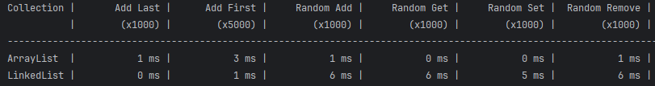
- ArrayList немного отстал на операциях добавления 
(возможно, за счет частого увеличения размера массива), но уже на рандомных операция отстал LinkedList

#### Второй тест (100 000 элементов String).

- Динамика сохраняется. На добавлении впереди LinkedList, на рандомных операциях ArrayList значительно быстрее

#### Третий тест (1 000 000 элементов String): 
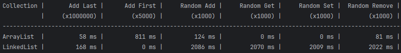
- ArrayList выходит вперед на добавлении в конец. Массив уже не надо так часто перестраивать и скорость получается выше

#### Четверый тест (10 000 000 элементов String): 
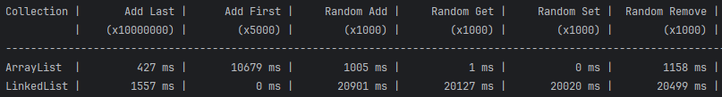
- Динамика та же. ArrayList быстрее везде кроме добавления в начало

По итогам тестов можно сделать 2 важных вывода:
- Единственная операция, где LinkedList имеет существенное преимущество перед ArrayList - это добавление в начало. 
Операция редкая и свойственная только очередям и алгоритмам с временным окном.
- Главная проблема LinkedList - рандомные операции. Эту проблему мы и будем решать!

## Архитектурные проблемы. Почему так медленно?
Классический двусвязный список (такой как в LinkedList) выглядит вот так:

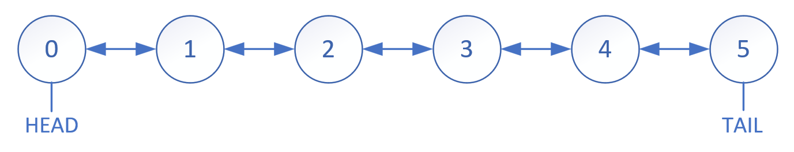

Такая архитектура имеет очевидную проблему. Когда мы запрашиваем случайный элемент по индексу происходит следующее:
- Индекс сравнивается с (list.size() / 2) чтобы выяснить, он ближе к голове или хвосту списка.
- Осуществляется проход по списку с головы или с хвоста по цепочке до нужного элемента

`Например, если мы запрашиваем 3-й элемент с картинки, то программа сначала определит, что 3>(5/2), 
то есть элемент ближе к хвосту, а затем сделает (5-3)=2 шага влево от хвоста списка.`

Таким образом, сложность всех операций, где требуется доступ по индексу - O(N). 
А это большинство операций - get(index), set(index), remove(index), add(index).

Значит, исправив это узкое место и ускорив поиск по индексу, мы значительно увеличим производительность всей коллекции.

## А давайте туда засунем кеширующий массив!

Зачем нам каждый раз проходить от края списка? 
Давайте сделаем кеширующий массив, который будет хранить каждый K-й элемент списка. 
Этим мы уменьшим максимальное количество итераций до K/2.

Теперь наш двусвязный список выглядит вот так:

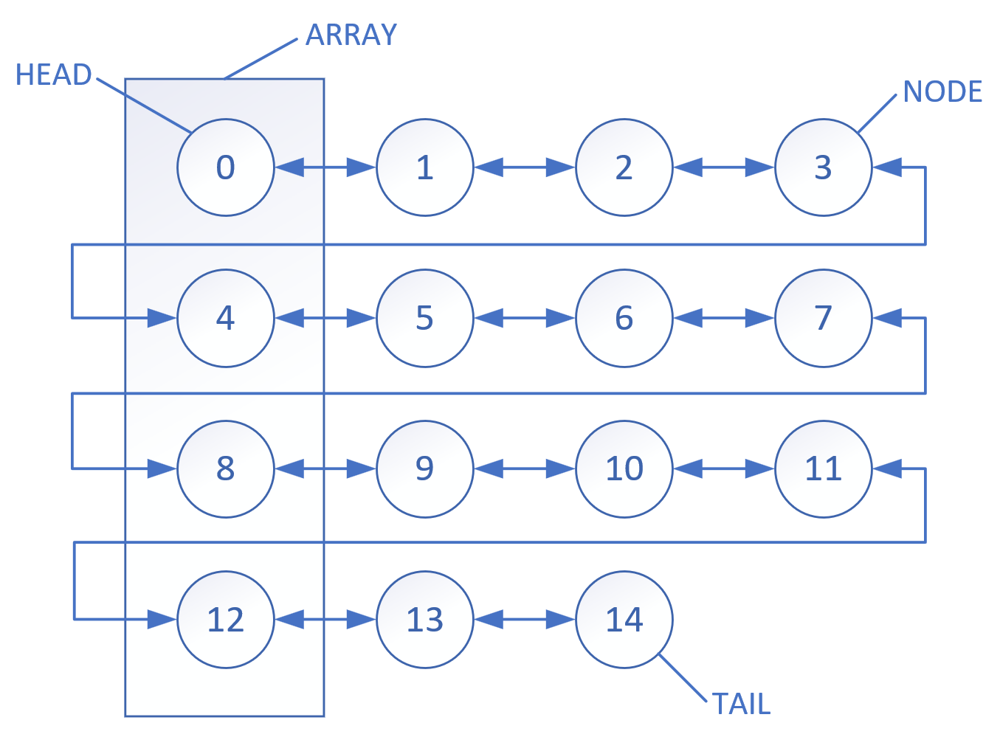

Если мы запрашиваем элемент 6, нам не нужно итерироваться от начала списка. Мы идем по такому алгоритму:
- Находим остаток от деления 6 на 4 (index % K) - это будет 2. Это не превышает K/2, значит двигаться будет от меньшего ближайшего элемента массива
- Находим индекс этого меньшего ближайшего элемента, разделив нацело 6 на 4 (index / K) и получаем 1.
- Берем элемент массива с индексом 1 - это будет элемент списка с индексом 4
- Движемся по списку на 2 узла вправо - получаем узел 6.
- Готово!

`Важно! Длину массива мы также возьмем равной K. Это совершенно не обязательно, 
но такой выбор облегчит нам увеличение размерности массива.
Каждый раз при переполнении массива, мы будем создавать новый с длиной в 2 раза 
больше и переписывать туда каждый второй элемент предыдущего массива. 
Тем самым, K также будет увеличиваться в 2 раза.`

Легко заметить, что сложность доступа по индексу теперь O(sqrt(N)), что гораздо лучше, чем первоначальная O(N).

## Неплохо бы это реализовать и проверить

Я имплементировал интерфейс List и реализовал там всю описанную логику. В основе коллекции - двусвязный список из элементов Node:

```
private static class Node<E> {
    Node<E> prev;
    E value;
    Node<E> next;
    ...
```

Кеширующий массив также содержит элементы типа Node:

```
public class MixedList<E> implements List<E> {
    static final int MAXIMUM_ARRAY_LENGTH = 1 << 16;
    static final int DEFAULT_INITIAL_CAPACITY = 1 << 6;
    
    private Node<E>[] array;
    private Node<E> head;
    private Node<E> tail;
    ...
```

А операция поиска по индексу выглядит вот так:

```
private Node<E> node(int index) {
    int row = index / length;
    int col = index % length;
    Node<E> node;
    if (col < length / 2) {
        node = array[row];
        for (int i = 0; i < col; i++) node = node.next;
    } else if ( size - index > length - col ) {
        node = array[row + 1];
        for (int i = length; i > col; i--) node = node.prev;
    } else {
        node = tail;
        for (int i = size - 1; i > index; i--) node = node.prev;
    }
    return node;
}
```

## Тесты, тесты тесты!!!

Теперь самое интересное - давайте протестируем, что получается.

#### Первый тест (1000 элементов String). 

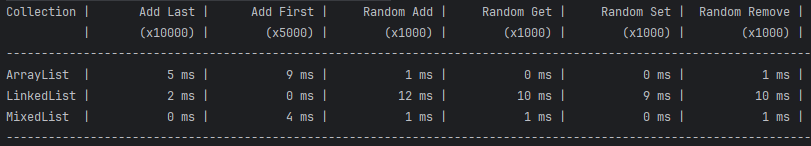

Начало отличное! Мы обгоняем ArrayList на операциях вставки, а главное - сильно обгоняем LinkedList в рандомных операциях

#### Второй тест (100 000 элементов String). 

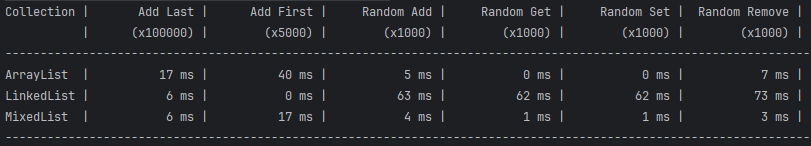

Отличный результат! Мы все еще впереди ArrayList на вставках и очень сильно обгоняем LinkedList в рандоме.

#### Третий тест (1 000 000 элементов String): 

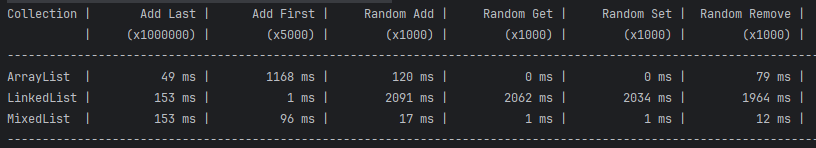

ArrayList снова выходит вперед на добавлении в конец. Зато на вставках в начало и середину заметно кратное отставание от нашего MixedList. Что же касается LinkedList, то там 100- и даже 1000-кратное отставание в рандомных операциях.

#### Четверый тест (10 000 000 элементов String): 

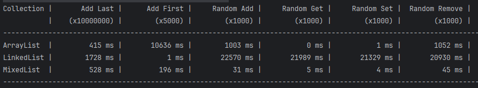

Вот тут ситуация становится по-настоящему любопытной. Потому что на таком объеме вылезают больные места всех коллекций: 
- ArrayList не любит вставки, особенно в начало. 
Также проблемной является операция удаления, при которой хвост массива сдвигается на единицу влево. 
- LinkedList в таком режиме вообще нефункционален. Простая операция get выполняется 22 сек. 
- Что же наш MixedList? А у него все хорошо. Нигде не выходим за границы 1 секунды.

В целом, как мне кажется, достойный результат. Но что будет в реальном цикле использования?

## Имитация реальной нагрузки
Если верить ChatGPT (а кому еще верить в наше время?) - то в реальной эксплуатации соотношение 
запросов на чтение/запись/обновление/удаление такое:

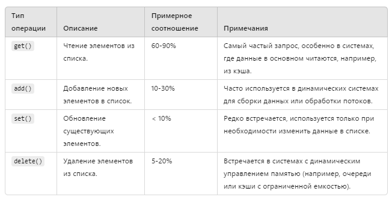

Давайте смоделируем 3 типа загрузки:
- 60% get(i), 25% add(), 5% add(i) , 5% set(i), 5% delete(i)
- 75% get(i), 15% add(), 2% add(i) , 4% set(i), 4% delete(i)
- 90% get(i), 5% add(), 1% add(i) , 2% set(i), 2% delete(i)

Мы проведем 5 тестов с разным размером коллекции. 
Для каждого теста мы будем сначала наполнять коллекцию определенным количеством элементов, 
а затем засекать время и проводить некоторое количество итераций, 
где сами операции распределяются случайным образом в заданной пропорции.

#### Первый тест (10 000 элементов String + 10 000 итераций).

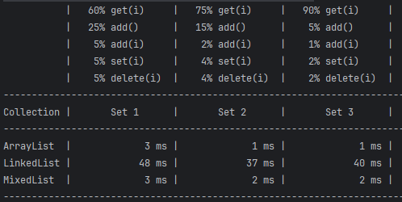

Уже на таком небольшом тесте видно серьезное отставание LinkedList на порядок.

#### Второй тест (100 000 элементов String + 10 000 итераций).


Отставание LinkedList усиливается. ArrayList впереди на двух сетах, но вот на третьем вперед выходит MixedList

#### Третий тест (1 000 000 элементов String + 10 000 итераций).

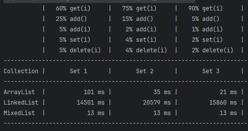

Во всех трех сетах лидер - MixedList:

#### Четверый тест (1 000 000 элементов String + 100 000 итераций).

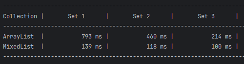

В этом тесте LinkedList уже не участвует. За лидерство бьются ArrayList и наш слоняра MixedList. И слоняра побеждает!

#### Фаталити! (10 000 000 элементов String + 100 000 итераций).

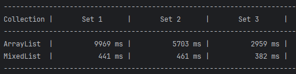

MixedList уходит в отрыв!

## ИТОГИ

За 2 недели я смог написать замену LinkedList-у, которая не только работает гораздо быстрее оригинала и 
сохраняет его базовые свойства, но еще и уделывает ArrayList на большом объеме данных и операций.

